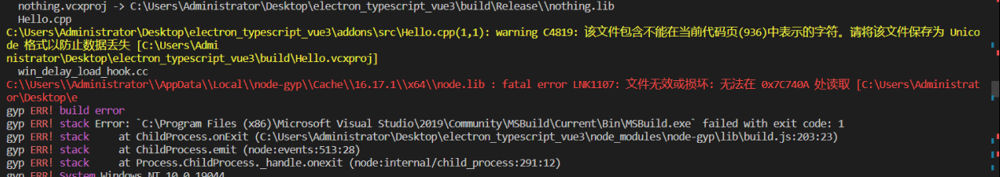

### 一、使用 gyp-build 前的准备
* 1、安装 Python 环境变量，在这个项目已经有，不方便下载可以直接用（高版本低版本32、64位都有）
* 2、安装 Visual Studio 要求2017及以上版本（选择桌面开发与C++开发组件）
* 3、为 vscode 安装c++扩展（ C/C++ for Visual Studio Code ），并且设置编译器路径为 VS 的 MSVC 的 C++编译器 cl.exe
  * 这一步主要是为了vscode能够解析C++语法以及调用C++库
* 4、注，如果在上面的配置做完之后，使用yarn gyp-build命令依旧出错，再执行下面配置（参考）
    * a、设置 msvs_version 配置 npm config edit 添加 msvs_version=2017 （版本根据安装来）
    * b、设置 VCINSTALLDIR 环境变量，例如 D:\program\VisualStudio\2017\Community\VC\

### 二、后续版本升级注意事项
* 1、由于使用electron-22.3.5版本（内置nodejs-16.17.1），如果后续升级electron版本，需要同时升级/src/addons/node-16.17.1的源码（用于编译addon），也就是需要与electron内置的nodejs版本匹配
* 2、当前项目涉及到 VS、MSVC 、Python 环境，在使用gyp-build命令是需要综合考虑这些的版本问题

### 三、问题打靶
1、如果出现下面问题

​		说明是node-gyp在build时下载的node.lib不对，这个文件属于node-gyp下载的缓存文件。有时候会因为网络问题导致node.lib下载失败或者出错，只需要把项目下的`./addon/gypCache`复制到`C:/Users/用户名/AppData/Local/node-gyp/Cache`对应版本内即可
